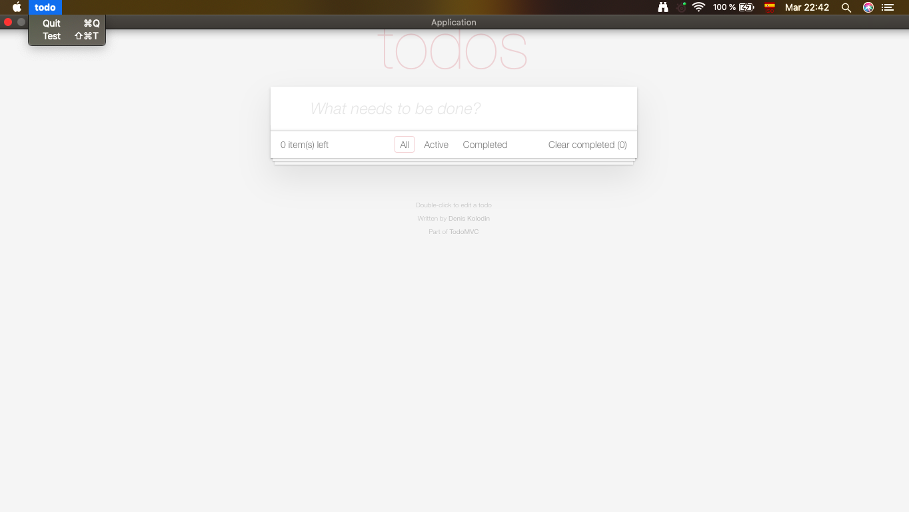
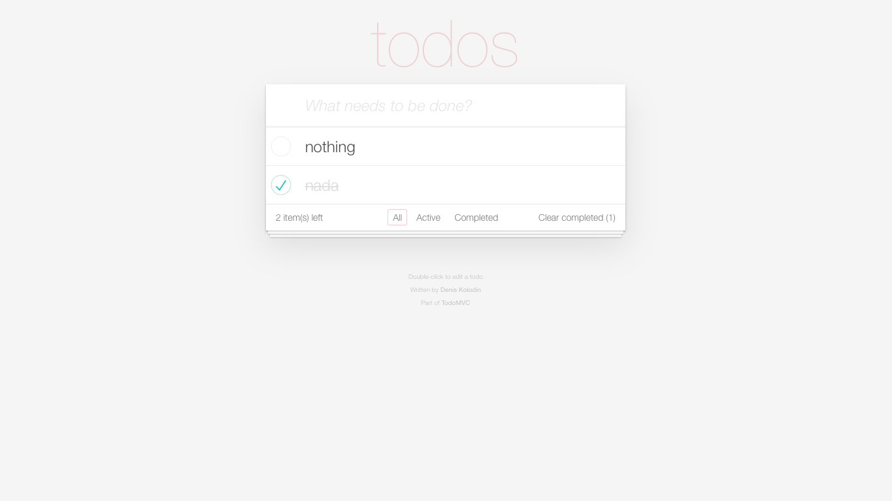
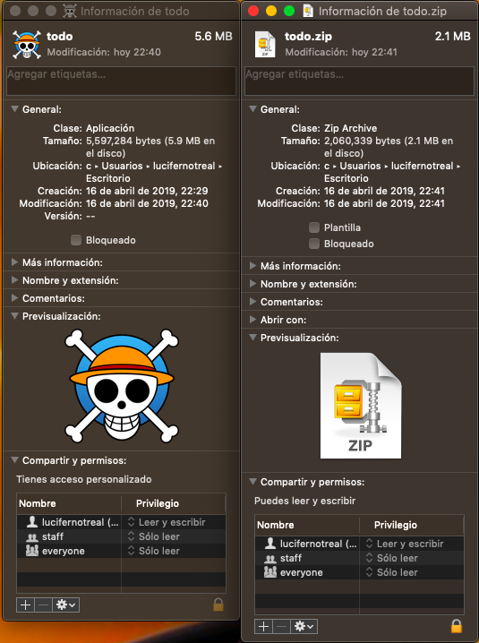

POC of webview calling cocoa apis to enable a native menu bar

Run 
```
cargo run
```
in the root folder

The code is awful. First I was going to test actix-web but then for some reason I proceeded to make this at 5:00am

"test" just prints to console.



The app works fine.



And it's very small. Left is the app and right is the app compressed in zip



